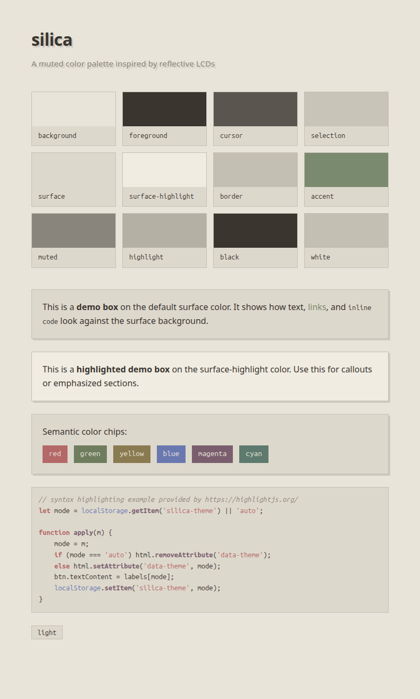
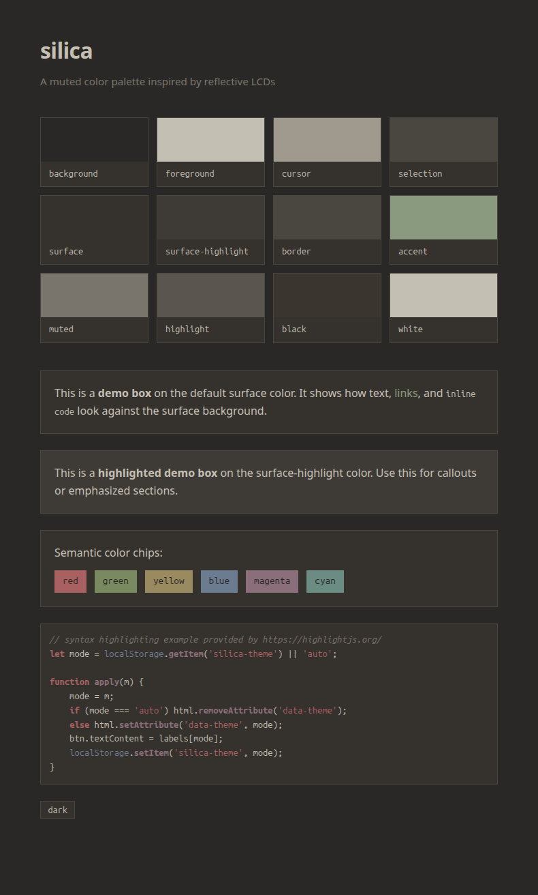

# Silica

A soft, muted color palette inspired by reflective LCDs and warm off-white UI.

## Palette

Colors are authored in hex in `palette.json`, which serves as the single source
of truth. The palette includes both **light** and **dark** variants.

## Integrations

| Integration | File | Variant |
|-------------|------|---------|
| Alacritty | [`alacritty/silica.toml`](alacritty/silica.toml) | dark |
| CSS | [`css/index.html`](css/index.html) | light + dark (via `prefers-color-scheme`) |

Open `css/index.html` in a browser to preview the palette.

## Previews

## AI Usage

All AI-generated code and content is reviewed and approved by a human
developer before inclusion. No AI is used at runtime. See
[AI_DISCLOSURE.md](./AI_DISCLOSURE.md)